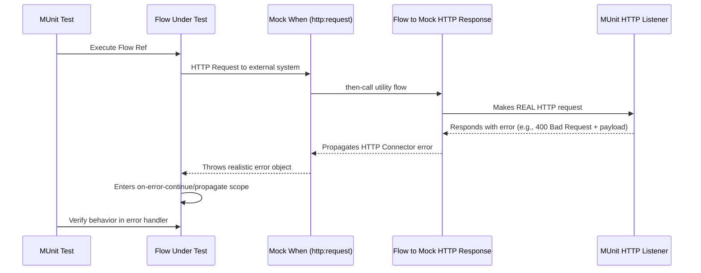

# Add HTTP Error Scenario

## Purpose
Create or update scenarios only, using realistic connector-like error simulation.

## Project References


```xml
<munit:enable-flow-sources>
  <munit:enable-flow-source
    value="munit-util-mock-http-error-with-errorMessage-test-suite.http-listener-for-mock-responses" />
  <munit:enable-flow-source
    value="munit-util-mock-http-error-with-errorMessage-test-suite.trigger-mock-http-request" />
</munit:enable-flow-sources>
```

```xml
<munit-tools:then-call
          flow="impl-test-suite.mock-http-req-external-400.flow" />
```

So, it's important to enable the flows (Listener or any other) that will be used in the test and for each Mock it will have a Flow in then call option
⚠️ The flow mentioned in the mock then call option doesn't need to be enabled in the MUnit test case.

ℹ️ You may think at *Import* the file that has the Flows that are used in the MUnit tests, but this doesn't work very well during the MUnit Test Run, so avoid this approach:

```xml
<import
    doc:name="Import"
    file="option-a\munit-util-mock-http-request-for-errorMessage-using-listener-localhost-test-suite.xml"
    doc:description="munit-util-mock-http-request-for-errorMessage-using-listener-localhost-test-suite.xml" />
```

Otherwise will get an error like:

```bash
org.mule.runtime.api.exception.MuleRuntimeException: org.mule.runtime.core.api.config.ConfigurationException: [munit-util-mock-http-request-for-errorMessage-using-listener-localhost-test-suite.xml:27; option-a\munit-util-mock-http-request-for-errorMessage-using-listener-localhost-test-suite.xml:27]: Two (or more) configuration elements have been defined with the same global name. Global name 'MUnit_HTTP_Listener_config' must be unique.
'munit-util-mock-http-error-with-errorMessage-test-suite.http-listener-for-mock-responses' must be unique.
[option-a/munit-util-mock-http-request-for-errorMessage-using-listener-localhost-test-suite.xml:67; option-a\munit-util-mock-http-request-for-errorMessage-using-listener-localhost-test-suite.xml:67]:
----

**Dynamic Port**

One or more options may use dynamic port feature from MUnit, the official documentation is available on [Dynamic Ports | MuleSoft Documentation](https://docs.mulesoft.com/munit/latest/dynamic-ports). Feel free to take a look.

**Reference Guide: Deep Dive into Options**
This section provides a detailed breakdown of each of the four testing strategies.

**Realistic Mocking with a Utility HTTP Listener**

This is the recommended approach for its balance of realism, reusability, and fine-grained control over the mocked error.

See also this Stack Overflow question related to this approach: https://stackoverflow.com/questions/78878885/munits-and-error-handling-how-to-mock-error-error-mulemessage

**Approach**

The core idea is to intercept an outbound `http:request` using a `mock-when` processor and, instead of returning a simple value, redirect the execution to a utility flow within the MUnit test suite using `then-call`.

This utility flow then makes a real HTTP request to a real HTTP listener that is also running as part of the MUnit test on a dynamic port.

This listener is strategically configured to generate a specific HTTP error response (status code, payload, headers). The HTTP connector within the utility flow receives this error response and naturally throws a standard Mule error, which is then propagated back through the mock.

This process creates a highly realistic, fully-structured error object for your test to validate, perfectly mimicking how the connector behaves in a production environment.

**Diagrams**



**Code Analysis**

The implementation utilizes two main flows that can be reused for each munit test case, it's important to mention that for each HTTP Request that you want to mock as error you will need to create or reference a respective flow that defines the structure (status code, payload, headers) you want to thrown.

```xml
<mule ...>

  <munit:config name="mule-configuration.xml" />

  <!-- 1. A dynamic port is reserved for the test listener to avoid conflicts. -->
  <munit:dynamic-port
    propertyName="munit.dynamic.port"
    min="6000"
    max="7000" />

  <!-- 2. The listener runs on the dynamic port defined above. -->
  <http:listener-config
    name="MUnit_HTTP_Listener_config"
    doc:name="HTTP Listener config">
    <http:listener-connection
      host="0.0.0.0"
      port="${munit.dynamic.port}" />
  </http:listener-config>

  <!-- This request config targets the local listener. -->
  <http:request-config name="MUnit_HTTP_Request_configuration">
    <http:request-connection
      host="localhost"
      port="${munit.dynamic.port}" />
  </http:request-config>

  <!-- 3. This flow acts as the mock server. It receives requests from the utility flow and generates the desired HTTP response. -->
  <flow name="munit-util-mock-http-error.listener">
    <http:listener
      doc:name="Listener"
      config-ref="MUnit_HTTP_Listener_config"
      path="/*">
      <http:response
        statusCode="#[(attributes.queryParams.statusCode default attributes.queryParams.httpStatus) default 200]"
        reasonPhrase="#[attributes.queryParams.reasonPhrase]">
        <http:headers>
          <![CDATA[#[attributes.headers]]]>
        </http:headers>
      </http:response>
      <http:error-response
        statusCode="#[(attributes.queryParams.statusCode default attributes.queryParams.httpStatus) default 500]"
        reasonPhrase="#[attributes.queryParams.reasonPhrase]">
        <http:body>
          <![CDATA[#[payload]]]>
        </http:body>
        <http:headers>
          <![CDATA[#[attributes.headers]]]>
        </http:headers>
      </http:error-response>
    </http:listener>
    <logger
      level="TRACE"
      doc:name="doc: Listener Response will Return the payload/http status for the respective request that was made to mock" />
    <!-- The listener simply returns whatever payload it received, but within an error response structure. -->
  </flow>

  <!-- 4. This is the reusable flow called by 'then-call'. Its job is to trigger the listener. -->
  <flow name="munit-util-mock-http-error.req-based-on-vars.munitHttp">
    <try doc:name="Try">
      <http:request
        config-ref="MUnit_HTTP_Request_configuration"
        method="#[vars.munitHttp.method default 'GET']"
        path="#[vars.munitHttp.path default '/']"
        sendBodyMode="ALWAYS">
        <!-- It passes body, headers and query params from a variable, allowing dynamic control over the mock's response. -->
        <http:body>
          <![CDATA[#[vars.munitBody]]]>
        </http:body>
        <http:headers>
          <![CDATA[#[vars.munitHttp.headers default {}]]]>
        </http:headers>
        <http:query-params>
          <![CDATA[#[vars.munitHttp.queryParams default {}]]]>
        </http:query-params>
      </http:request>
      <!-- The error generated by the listener is naturally propagated back to the caller of this flow. -->
      <error-handler>
        <on-error-propagate doc:name="On Error Propagate">
          <!-- Both error or success will remove the variables for mock, so it doesn't mess with the next operation in the flow/subflow that are being tested. -->
          <remove-variable
            doc:name="munitHttp"
            variableName="munitHttp" />
          <remove-variable
            doc:name="munitBody"
            variableName="munitBody" />
        </on-error-propagate>
      </error-handler>
    </try>
    <remove-variable
      doc:name="munitHttp"
      variableName="munitHttp" />
    <remove-variable
      doc:name="munitBody"
      variableName="munitBody" />
  </flow>


  <munit:test
    name="impl-test-suite-impl-sub-flowTest"
    timeOut="900000">
    <!-- 5. Critical Step: You must enable the utility flows so they can be discovered and called by the MUnit runtime. -->
    <munit:enable-flow-sources>
      <munit:enable-flow-source
        value="munit-util-mock-http-error.req-based-on-vars.munitHttp" />
      <munit:enable-flow-source
        value="munit-util-mock-http-error.listener" />
    </munit:enable-flow-sources>
    <munit:behavior>
      <!-- -->
      <munit-tools:mock-when
        doc:name="Mock HTTP Req External -&gt; then call flow 400 ;"
        processor="http:request">
        <munit-tools:with-attributes>
          <!-- Identify the specific http:request instance to intercept. -->
          <munit-tools:with-attribute
            whereValue="GET"
            attributeName="method" />
          <munit-tools:with-attribute
            whereValue="http://example.com/external"
            attributeName="url" />
        </munit-tools:with-attributes>
        <munit-tools:then-call
          flow="impl-test-suite.mock-http-req-external-400.flow" />
      </munit-tools:mock-when>
      <!-- -->
      <munit-tools:mock-when
        doc:name="Mock HTTP Req System -&gt; then call flow 503 ;"
        processor="http:request">
        <munit-tools:with-attributes>
          <munit-tools:with-attribute
            whereValue="GET"
            attributeName="method" />
          <munit-tools:with-attribute
            whereValue="http://example.com/system"
            attributeName="url" />
        </munit-tools:with-attributes>
        <!-- 6. Instead of returning a value, instruct the mock to call our setup flow. -->
        <munit-tools:then-call
          flow="impl-test-suite.mock-http-req-system-503.flow" />
      </munit-tools:mock-when>
      <!-- -->
      <munit-tools:spy
        doc:name="Spy HTTP Req System GET /health"
        processor="http:request">
        <munit-tools:with-attributes>
          <munit-tools:with-attribute
            whereValue="GET"
            attributeName="method" />
          <munit-tools:with-attribute
            whereValue="HTTP_Request_configuration_System"
            attributeName="config-ref" />
          <munit-tools:with-attribute
            whereValue="/health"
            attributeName="path" />
        </munit-tools:with-attributes>
      </munit-tools:spy>
      <!-- -->
      <munit-tools:mock-when
        doc:name="Mock HTTP Req Process -&gt; then call flow (default 200) ;"
        processor="http:request">
        <munit-tools:with-attributes>
          <munit-tools:with-attribute
            whereValue="GET"
            attributeName="method" />
          <munit-tools:with-attribute
            whereValue="http://example.com/process"
            attributeName="url" />
        </munit-tools:with-attributes>
        <munit-tools:then-call
          flow="munit-util-mock-http-error.req-based-on-vars.munitHttp" />
      </munit-tools:mock-when>
    </munit:behavior>
    <!-- -->
    <munit:execution>
      <flow-ref
        doc:name="Flow-ref to impl-for-option-a.subflow"
        name="impl-for-option-a" />
    </munit:execution>
    <!-- -->
    <munit:validation>
      <munit-tools:verify-call
        doc:name="ERROR EXCEPTION Req External"
        processor="logger"
        atLeast="1">
        <munit-tools:with-attributes>
          <munit-tools:with-attribute
            whereValue="ERROR EXCEPTION Req External"
            attributeName="doc:name" />
        </munit-tools:with-attributes>
      </munit-tools:verify-call>
      <!-- -->
      <munit-tools:verify-call
        doc:name="ERROR EXCEPTION Req System"
        processor="logger"
        atLeast="1">
        <munit-tools:with-attributes>
          <munit-tools:with-attribute
            whereValue="ERROR EXCEPTION Req System"
            attributeName="doc:name" />
        </munit-tools:with-attributes>
      </munit-tools:verify-call>
      <!-- -->
      <munit-tools:verify-call
        doc:name="3x HTTP Req MUnit Listener"
        processor="http:request"
        times="3">
        <munit-tools:with-attributes>
          <munit-tools:with-attribute
            whereValue="MUnit_HTTP_Request_configuration"
            attributeName="config-ref" />
        </munit-tools:with-attributes>
      </munit-tools:verify-call>
    </munit:validation>
  </munit:test>


  <!-- 7. This flow acts as a test-specific setup, preparing the data for the mock. -->
  <flow name="impl-test-suite.mock-http-req-external-400.flow">
    <ee:transform
      doc:name="munitHttp {queryParams: statusCode: 400 } } ; munitBody ;"
      doc:id="904f4a7e-b23d-4aed-a4e1-f049c97434ef">
      <ee:message></ee:message>
      <ee:variables>
        <!-- This variable will become the body of the error response. -->
        <ee:set-variable variableName="munitBody">
          <![CDATA[%dw 2.0 output application/json --- { message: "Account already exists!" }]]>
        </ee:set-variable>
        <!-- This variable passes the desired status code to the listener via query parameters. -->
        <ee:set-variable variableName="munitHttp">
          <![CDATA[%dw 2.0 output application/java ---
{
  path  : "/",
  method: "GET",
  queryParams: {
    statusCode: 400,
  },
}]]>
        </ee:set-variable>
      </ee:variables>
    </ee:transform>
    <!-- 8. Finally, call the reusable utility flow to trigger the mock listener. -->
    <flow-ref
      doc:name="FlowRef req-based-on-vars.munitHttp-flow"
      name="munit-util-mock-http-error.req-based-on-vars.munitHttp" />
  </flow>


  <flow name="impl-test-suite.mock-http-req-system-503.flow">
    <ee:transform
      doc:name="munitHttp {queryParams: statusCode: 503 } } ; munitBody ;"
      doc:id="de07920c-9cbc-4a52-aa8b-81fe4de93229">
      <ee:message></ee:message>
      <ee:variables>
        <ee:set-variable variableName="munitHttp">
          <![CDATA[%dw 2.0
output application/java
---
{
  path  : "/",
  method: "GET",
  queryParams: {
    statusCode: 503,
  },
}]]>
        </ee:set-variable>
        <ee:set-variable variableName="munitBody">
          <![CDATA[%dw 2.0
output application/json indent=false
---
{
  message: ""
}]]>
        </ee:set-variable>
      </ee:variables>
    </ee:transform>
    <!-- -->
    <flow-ref
      doc:name="FlowRef req-based-on-vars.munitHttp-flow"
      name="munit-util-mock-http-error.req-based-on-vars.munitHttp" />
  </flow>

</mule>
```


## Procedure
1. Review existing runtime and test flow names and selectors.
2. Add or update runtime branch logic in flow:
   - status code condition
   - payload condition if needed
   - branch-specific behavior
3. Add or update MUnit behavior:
   - mock-when for target request
   - then-call to scenario helper flow
   - helper variables for payload and status
   - helper flow-ref to reusable request trigger
4. Ensure required helper flow sources are enabled in the test.
5. Add assertions that prove branch behavior and outcome.
6. Confirm selector alignment between runtime requests and test mocks.

## Quality Checklist
- Runtime and test files both updated.
- Dynamic port listener pattern preserved.
- No duplicate global config naming conflicts introduced.
- Assertions verify intended branch execution and final behavior.
- Changes remain inside the scope unless explicitly requested otherwise.
